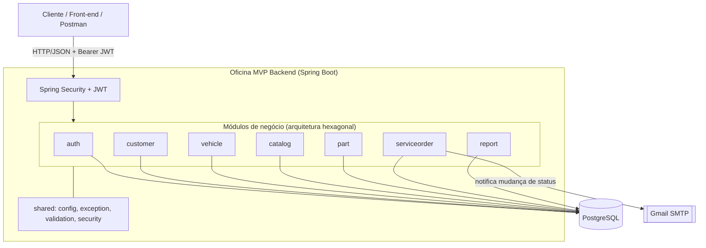
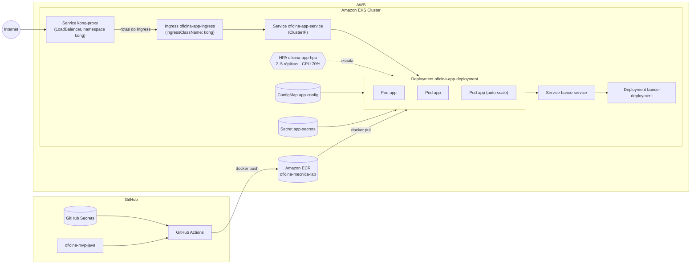

# Oficina MVP Backend — Java 25 + Spring Boot 4

Back-end monolítico para um MVP de **oficina mecânica**, desenvolvido com **Java 25**, **Spring Boot 4**, **Maven**, *
*PostgreSQL**, **JPA/Hibernate**, **Flyway**, **Spring Security**, **JWT** e **Swagger/OpenAPI**.

O projeto permite gerenciar clientes, veículos, catálogo de serviços, peças/insumos, ordens de serviço, orçamento
automático, aprovação pelo cliente, histórico de status e relatório de tempo médio de execução.

## Sumário

- [Stack](#stack)
- [Funcionalidades](#funcionalidades)
- [Arquitetura do projeto](#arquitetura-do-projeto)
- [Diagramas](#diagramas)
- [Como rodar localmente](#como-rodar-localmente)
- [Como rodar com Docker](#como-rodar-com-docker)
- [Deploy em Kubernetes](#deploy-em-kubernetes)
- [Infraestrutura como código (Terraform)](#infraestrutura-como-código-terraform)
- [Variáveis de ambiente](#variáveis-de-ambiente)
- [Usuário admin inicial](#usuário-admin-inicial)
- [Autenticação](#autenticação)
- [Endpoints principais](#endpoints-principais)
- [Payloads úteis](#payloads-úteis)
- [Banco de dados](#banco-de-dados)
- [Testes e cobertura](#testes-e-cobertura)
- [Collection de APIs](#collection-de-apis)
- [Vídeo demonstrativo](#vídeo-demonstrativo)
- [Documentação complementar](#documentação-complementar)
- [Pontos de atenção](#pontos-de-atenção)
- [Roadmap / TODO](#roadmap--todo)

## Stack

| Item                | Tecnologia                     |
|---------------------|--------------------------------|
| Linguagem           | Java 25                        |
| Framework           | Spring Boot 4.0.6              |
| Build               | Maven                          |
| API                 | Spring WebMVC                  |
| Persistência        | Spring Data JPA / Hibernate    |
| Banco               | PostgreSQL                     |
| Migrações           | Flyway                         |
| Segurança           | Spring Security + JWT Bearer   |
| JWT                 | JJWT 0.12.6                    |
| Validação           | Jakarta Bean Validation        |
| Documentação da API | SpringDoc OpenAPI / Swagger UI |
| Observabilidade     | Spring Boot Actuator           |
| Testes              | JUnit 5, Mockito, MockMvc, H2  |
| Cobertura           | JaCoCo                         |
| Container           | Docker + Docker Compose        |

## Funcionalidades

- Login administrativo com JWT.
- CRUD de clientes.
- CRUD de veículos vinculados a clientes.
- CRUD de serviços do catálogo da oficina.
- CRUD de peças/insumos com estoque e estoque mínimo.
- Criação de ordem de serviço com cliente, veículo, serviços e peças.
- Geração automática de orçamento da OS.
- Cálculo automático de total de serviços, total de peças e total geral.
- Consulta pública de OS por código e CPF/CNPJ.
- Aprovação pública do orçamento pelo cliente.
- Aprovação administrativa do orçamento.
- Validação de estoque antes da aprovação.
- Baixa automática de estoque na aprovação.
- Controle de transição de status da OS.
- Preenchimento/atualização do diagnóstico da OS.
- Histórico de status da OS.
- Relatório de tempo médio de execução.
- Healthcheck da aplicação.
- Swagger/OpenAPI.
- Seed inicial de usuário admin, serviços e peças.

## Arquitetura do projeto

O projeto é um **monolito modular organizado por módulos de negócio**, seguindo os princípios de **Arquitetura
Hexagonal (Ports & Adapters)**. Cada módulo (`customer`, `vehicle`, `catalog`, `part`, `auth`, `serviceorder`,
`report`) é um pacote físico próprio com o mesmo esqueleto interno:

```txt
src/main/java/br/com/oficina/mvp/
  OficinaMvpApplication.java
  <modulo>/
    domain/                     modelo de domínio puro (POJO, sem anotação JPA) e regras de negócio do módulo
    application/                caso de uso (implementa as portas de entrada)
    application/port/in/        portas de entrada — interface de caso de uso + Command/Result
    application/port/out/       portas de saída — o que o módulo precisa de fora (ex: repositório)
    adapter/in/web/             controller REST + DTOs de request/response
    adapter/out/persistence/    entidade JPA + mapper (domínio ↔ entidade) + repositório Spring Data
                                 (package-private) + adapter da porta
  shared/
    domain/      vocabulário compartilhado entre módulos (BaseDomain, enums Role e ServiceOrderStatus)
    persistence/ infraestrutura JPA compartilhada (BaseJpaEntity)
    config/      segurança, CORS, OpenAPI, seed e properties
    exception/   exceções e handler global
    security/    filtro e serviço JWT
    validation/  validadores de CPF/CNPJ e placa
    api/         endpoints técnicos que não pertencem a um módulo de negócio (healthcheck)
```

O `domain` de cada módulo é um POJO puro — sem `@Entity`, sem nenhuma dependência de `jakarta.persistence` — e a
entidade JPA correspondente (`XJpaEntity`) vive isolada dentro de `adapter/out/persistence`, junto com o `XMapper`
que converte entre as duas. Isso mantém a regra de dependência da Arquitetura Hexagonal: `domain` não conhece
framework nenhum. Detalhes de como o mapper monta o grafo de agregados (ex: `ServiceOrder` com cliente, veículo,
itens e histórico) estão em [`docs/architecture.md`](docs/architecture.md).

Quando um módulo precisa de outro (por exemplo `serviceorder` buscando `Customer`, `Vehicle`, `ServiceCatalogItem` e
`Part`), ele depende sempre da **porta** do módulo alheio (`CustomerRepositoryPort`, `VehicleUseCase` etc.), nunca da
implementação concreta ou do repositório JPA do outro módulo. Detalhamento completo, camada por camada e módulo por
módulo, está em [`docs/architecture.md`](docs/architecture.md).

As principais regras de negócio ficam em:

- `ServiceOrderService` (módulo `serviceorder`): criação, aprovação, validação de estoque, baixa de estoque, consulta
  pública e status de OS;
- `ServiceOrder`: cálculo de totais, histórico e timestamps de status;
- `ServiceOrderStatusPolicy`: transições permitidas de status;
- `DocumentValidator`: validação de CPF/CNPJ;
- `PlateValidator`: validação de placa antiga e Mercosul;
- `Part`: normalização de SKU e baixa de estoque.

## Diagramas

### Componentes da aplicação



Cada módulo segue o esqueleto `domain` → `application` (`port/in`/`port/out`) → `adapter/in/web` /
`adapter/out/persistence` descrito em [Arquitetura do projeto](#arquitetura-do-projeto).

### Infraestrutura provisionada



> O Kong (API Gateway) é provisionado no cluster pelo repositório `oficina-mvp-infra-iac` (via Helm, modo
> DB-less com Ingress Controller habilitado); este repositório só declara o `Ingress` (`k8s/ingress.yaml`) que
> aponta pra ele. É um gateway distinto do usado pela `oficina-auth-function` (que tem seu próprio API Gateway
> da AWS na frente da Lambda) — ver [Infraestrutura como código (Terraform)](#infraestrutura-como-código-terraform).

## Como rodar localmente

### 1. Pré-requisitos

- Java 25.
- Maven.
- Docker e Docker Compose, caso queira subir o PostgreSQL localmente via container.

### 2. Criar o arquivo `.env`

Linux/macOS:

```bash
cp .env.example .env
```

Windows PowerShell:

```powershell
Copy-Item .env.example .env
```

### 3. Subir o PostgreSQL

```bash
docker compose up -d postgres
```

### 4. Rodar a aplicação

```bash
mvn spring-boot:run
```

A API sobe em:

```txt
http://localhost:3000
```

URLs úteis:

```txt
Swagger UI: http://localhost:3000/swagger-ui.html
OpenAPI:    http://localhost:3000/v3/api-docs
Health:     http://localhost:3000/api/health
Actuator:   http://localhost:3000/actuator/health
```

> Isso sobe só este backend. Para exercitar as rotas públicas de OS (que exigem token de cliente), também é
> preciso rodar a `oficina-auth-function` — ver
> [Testando o fluxo público localmente](#testando-o-fluxo-público-localmente-com-a-function).

## Como rodar com Docker

Para subir banco e API juntos:

```bash
docker compose up --build
```

Para parar:

```bash
docker compose down
```

Para remover também o volume do banco:

```bash
docker compose down -v
```

### Testando o Kong (API Gateway) localmente

O `docker-compose.yml` também sobe um serviço `kong` (modo DB-less, config declarativa em
[`kong/kong.yml`](kong/kong.yml)) na porta `8000`, reproduzindo localmente o mesmo papel do Kong que roda no
EKS (provisionado pelo `oficina-mvp-infra-iac`) — útil pra validar o roteamento sem gastar crédito do lab AWS:

```bash
docker compose up -d --build
curl http://localhost:8000/api/health
```

A resposta deve ser igual à de `curl http://localhost:3000/api/health` direto na API — a diferença é que a
chamada passou pelo Kong antes de chegar no serviço `api`.

O `Dockerfile` usa build multi-stage:

1. imagem Maven com Eclipse Temurin 25 para empacotar o projeto;
2. imagem JRE Eclipse Temurin 25 para executar o `app.jar`.

## Deploy em Kubernetes

Os manifests ficam em [`/k8s`](k8s):

| Arquivo              | Recursos                                                                                        |
|-----------------------|--------------------------------------------------------------------------------------------------|
| `config-secret.yaml`  | `ConfigMap app-config` + `Secret app-secrets` (credenciais de banco, JWT, admin seed e e-mail)   |
| `banco.yaml`          | `Deployment banco-deployment` + `Service banco-service` (PostgreSQL)                             |
| `app.yaml`            | `Deployment oficina-app-deployment` (com `resources.requests/limits`) + `Service` (ClusterIP)    |
| `hpa.yaml`            | `HorizontalPodAutoscaler oficina-app-hpa` (2 a 5 réplicas, CPU 70%)                               |
| `ingress.yaml`        | `Ingress oficina-app-ingress` (`ingressClassName: kong`) — rota que o Kong usa pra encontrar o Service da app |

> O `Service` da aplicação é `ClusterIP` — quem recebe tráfego externo é o `Service` do Kong (`kong-proxy`,
> namespace `kong`), provisionado no repositório [`oficina-mvp-infra-iac`](https://github.com/lukebria/oficina-mvp-infra-iac).

### Via CI/CD (automático)

A pipeline (`.github/workflows/app-deploy.yml`) aplica os manifests automaticamente a cada push em `main`/`master`,
depois de rodar os testes, o SonarQube e o build/push da imagem Docker para o ECR — ver
[Fluxo de deploy (CI/CD)](#diagramas).

### Manualmente (fora da pipeline)

Pré-requisito: um cluster Kubernetes acessível via `kubectl` (local, como kind/minikube, ou remoto, como EKS).

```bash
kubectl apply -f k8s/config-secret.yaml
kubectl apply -f k8s/banco.yaml
kubectl apply -f k8s/app.yaml
kubectl apply -f k8s/hpa.yaml
kubectl apply -f k8s/ingress.yaml
```

> `k8s/ingress.yaml` só tem efeito se o Kong (com o Ingress Controller habilitado) já estiver instalado no
> cluster — ver `oficina-mvp-infra-iac`.

> ⚠️ `k8s/config-secret.yaml` e `k8s/app.yaml` têm placeholders (`${DB_PASSWORD}`, `${JWT_SECRET}`,
> `${SEED_ADMIN_PASSWORD}`, `${ECR_REPOSITORY_URL}`) que na pipeline são substituídos via `envsubst`/`sed` a partir de
> GitHub Secrets antes do `apply`. Para aplicar manualmente, substitua esses valores você mesmo antes de rodar os
> comandos acima.

## Infraestrutura como código (Terraform)

O provisionamento do cluster Kubernetes (EKS) e do repositório ECR é feito via Terraform no repositório
[`oficina-mvp-infra-iac`](https://github.com/lukebria/oficina-mvp-infra-iac) — fora deste repositório. Ele
provisiona o cluster `oficina-mecnica-lab-cluster` e o ECR `oficina-mecnica-lab` numa conta de **AWS Academy
Learner Lab** (credenciais temporárias com session token, role `LabRole` fixa do ambiente — sem IAM role
própria).

O banco de dados **não** é provisionado por Terraform em lugar nenhum hoje — ele roda como um `Deployment` comum
de Postgres dentro do mesmo cluster (`k8s/banco.yaml`, neste repositório), sem backup nem alta disponibilidade.
Ver [Roadmap / TODO](#roadmap--todo).

Enquanto isso, a pipeline deste repositório assume que o cluster e o ECR **já existem** (ver
`aws eks update-kubeconfig` em `.github/workflows/app-deploy.yml`).

## Variáveis de ambiente

As variáveis estão documentadas no `.env.example` e são lidas pelo `application.yml`.

| Variável                 | Padrão                                                         | Descrição                   |
|--------------------------|----------------------------------------------------------------|-----------------------------|
| `APP_PORT`               | `3000`                                                         | Porta HTTP da API           |
| `DB_HOST`                | `localhost`                                                    | Host do PostgreSQL          |
| `DB_PORT`                | `5432`                                                         | Porta do PostgreSQL         |
| `DB_NAME`                | `oficina_mvp`                                                  | Nome do banco               |
| `DB_USER`                | `oficina`                                                      | Usuário do banco            |
| `DB_PASSWORD`            | `oficina`                                                      | Senha do banco              |
| `JWT_SECRET`             | `troque-este-segredo-em-producao-com-pelo-menos-32-caracteres` | Segredo de assinatura do JWT administrativo (login por e-mail/senha) |
| `JWT_EXPIRES_IN_MINUTES` | `480` no `application.yml`; `30` no `.env.example`             | Expiração do JWT em minutos |
| `CUSTOMER_JWT_SECRET`    | `troque-este-segredo-de-cliente-em-producao-com-pelo-menos-32-caracteres` | Segredo dedicado do JWT do fluxo público (autenticação via CPF), emitido pela Function Serverless externa |
| `INTERNAL_API_KEY`       | `troque-esta-chave-interna-em-producao`                       | Chave de serviço-a-serviço para `GET /api/internal/customers/{document}` (consumido pela Function Serverless externa) |
| `CORS_ALLOWED_ORIGINS`   | `http://localhost:5173,http://localhost:3000`                  | Origens permitidas no CORS  |
| `SEED_ADMIN_EMAIL`       | `admin@oficina.com`                                            | Email do admin inicial      |
| `SEED_ADMIN_PASSWORD`    | `Admin@123`                                                    | Senha do admin inicial      |
| `MAIL_HOST`              | `smtp.gmail.com`                                               | Host SMTP                   |
| `MAIL_PORT`              | `587`                                                          | Porta SMTP (STARTTLS)       |
| `MAIL_USERNAME`          | *(vazio)*                                                      | Usuário/e-mail SMTP         |
| `MAIL_PASSWORD`          | *(vazio)*                                                      | Senha de app do Gmail       |
| `MAIL_FROM`              | `MAIL_USERNAME` ou `no-reply@oficina.com`                      | Remetente dos e-mails de notificação de status |

>
> ```yaml
> mail:
>   host: ${MAIL_HOST:smtp.gmail.com}
>   port: ${MAIL_PORT:587}
>   from: ${MAIL_FROM:${MAIL_USERNAME:no-reply@oficina.com}}
> ```


## Usuário admin inicial

Ao iniciar fora do profile `test`, o sistema cria automaticamente um usuário admin se ele ainda não existir:

```txt
email: admin@oficina.com
senha: Admin@123
```

Esses valores podem ser alterados no `.env` usando:

```txt
SEED_ADMIN_EMAIL=
SEED_ADMIN_PASSWORD=
```

Além do admin, o seed inicial também cria alguns serviços e peças para facilitar testes locais.

## Autenticação

### Login

```http
POST /api/auth/login
Content-Type: application/json
```

```json
{
  "email": "admin@oficina.com",
  "password": "Admin@123"
}
```

Resposta esperada:

```json
{
  "token": "<jwt>",
  "user": {
    "id": 1,
    "name": "Administrador",
    "email": "admin@oficina.com",
    "role": "ADMIN"
  }
}
```

Use o token nas rotas protegidas:

```http
Authorization: Bearer <token>
```

### Rotas públicas

- `POST /api/auth/login`
- `/api/health`
- `/actuator/health`
- `/swagger-ui.html`
- `/swagger-ui/**`
- `/v3/api-docs/**`

As demais rotas exigem JWT. `/api/public/service-orders/**` **não** é mais uma rota aberta — veja
[Autenticação via CPF (fluxo público do cliente)](#autenticação-via-cpf-fluxo-público-do-cliente) — e
`/api/internal/**` exige a chave de serviço `INTERNAL_API_KEY`, não um JWT.

### Autenticação via CPF (fluxo público do cliente)

**Rotas que exigem o token emitido pela [`oficina-auth-function`](https://github.com/lukebria/oficina-auth-function)** (nenhuma outra rota
deste backend depende dela):

```http
GET  /api/public/service-orders/{code}
POST /api/public/service-orders/{code}/approval
Authorization: Bearer <token-cliente>
```

Todas as demais rotas seguem com o JWT administrativo (`POST /api/auth/login`) ou a `X-Internal-Api-Key`
(`/api/internal/**`) — só estas duas dependem de um token vindo da Function externa.

Esse token **não é emitido por este backend** — é emitido por uma Function Serverless em outro repositório, que:

1. valida o CPF informado pelo cliente;
2. consulta `GET /api/internal/customers/{document}` (autenticado por `X-Internal-Api-Key: <INTERNAL_API_KEY>`) para
   confirmar que o cliente existe e está `ACTIVE` — resposta traz `status`: `ACTIVE`, `INACTIVE` ou `NOT_FOUND`
   (quando o documento não corresponde a nenhum cliente);
3. assina um JWT com `CUSTOMER_JWT_SECRET` (segredo dedicado, diferente do `JWT_SECRET` administrativo), claims
   `sub` = documento normalizado (só dígitos) e `role` = `"CUSTOMER"`.

O documento do cliente autenticado vem sempre do token (nunca de um parâmetro de request) — por isso o token só
permite consultar/aprovar a OS do próprio CPF, mesmo que o cliente tente informar outro código. Além disso,
`JwtAuthenticationFilter` revalida o status do cliente **a cada request**: se o cliente for marcado `INACTIVE`
depois de o token ter sido emitido, esse token para de autenticar imediatamente, sem esperar expirar.

### Testando o fluxo público localmente (com a Function)

Pra exercitar `GET /api/public/service-orders/{code}` e `POST /api/public/service-orders/{code}/approval` de
ponta a ponta em ambiente local, é preciso rodar também a
[`oficina-auth-function`](https://github.com/lukebria/oficina-auth-function), que é quem emite o token de cliente:

1. Suba este backend normalmente (ver [Como rodar localmente](#como-rodar-localmente)).
2. No `.env` da function, aponte `BACKEND_BASE_URL` para `http://localhost:3000` e use os **mesmos valores** de
   `INTERNAL_API_KEY` e `CUSTOMER_JWT_SECRET` configurados no `.env` deste backend — os dois lados têm que
   compartilhar os mesmos segredos, senão a consulta interna ou a validação do JWT falham.
3. Rode a function localmente (`npm test` valida a lógica; para invocar o handler de fato é preciso simular um
   evento de API Gateway, já que o repositório da function não inclui infra local tipo SAM CLI).
4. Use o token retornado pela function no header `Authorization: Bearer <token>` das rotas públicas acima.

Sem a function rodando (ou sem os segredos batendo), essas duas rotas sempre respondem `401`, já que não há
outra forma de emitir esse token.

### Autorização por perfil

Além de exigir JWT, as rotas abaixo checam o `role` do usuário autenticado (`ADMIN`, `MECHANIC`, `ATTENDANT`),
aplicado via `hasRole`/`hasAnyRole` em `SecurityConfig`. Fora dessa lista, qualquer usuário autenticado tem acesso.

| Rota                                        | Método | Perfis permitidos         |
|----------------------------------------------|--------|----------------------------|
| `/api/customers`, `/api/customers/{id}`       | GET    | ADMIN, MECHANIC, ATTENDANT |
| `/api/customers`                              | POST   | ADMIN, MECHANIC, ATTENDANT |
| `/api/customers/{id}`                         | PUT    | ADMIN, MECHANIC, ATTENDANT |
| `/api/customers/{id}`                         | DELETE | ADMIN                      |
| `/api/vehicles`, `/api/vehicles/{id}`         | GET    | ADMIN, MECHANIC, ATTENDANT |
| `/api/vehicles`                               | POST   | ADMIN, MECHANIC, ATTENDANT |
| `/api/vehicles/{id}`                          | PUT    | ADMIN, MECHANIC, ATTENDANT |
| `/api/vehicles/{id}`                          | DELETE | ADMIN                      |
| `/api/services`, `/api/services/{id}`         | GET    | ADMIN, MECHANIC, ATTENDANT |
| `/api/services`                               | POST   | ADMIN                      |
| `/api/services/{id}`                          | PUT    | ADMIN                      |
| `/api/services/{id}`                          | DELETE | ADMIN                      |
| `/api/parts`, `/api/parts/{id}`               | GET    | ADMIN, MECHANIC, ATTENDANT |
| `/api/parts`                                  | POST   | ADMIN                      |
| `/api/parts/{id}`                             | PUT    | ADMIN                      |
| `/api/parts/{id}`                             | DELETE | ADMIN                      |
| `/api/service-orders`, `/api/service-orders/{id}` | GET | ADMIN, MECHANIC, ATTENDANT |
| `/api/service-orders`                         | POST   | ADMIN, MECHANIC, ATTENDANT |
| `/api/service-orders/{id}/approval`           | PATCH  | ADMIN, MECHANIC            |
| `/api/service-orders/{id}/status`             | PATCH  | ADMIN, MECHANIC            |
| `/api/service-orders/{id}/diagnosis`          | PATCH  | ADMIN, MECHANIC            |
| `/api/reports/average-execution-time`         | GET    | ADMIN                      |
| `/api/public/service-orders/{code}`           | GET    | CUSTOMER (token via CPF)   |
| `/api/public/service-orders/{code}/approval`  | POST   | CUSTOMER (token via CPF)   |
| `/api/internal/customers/{document}`          | GET    | `X-Internal-Api-Key` (não é role de JWT) |

`GET /api/health` e `GET /actuator/health` foram mantidos públicos (sem exigir role) para não quebrar a convenção de
healthcheck usada por orquestradores/monitoramento — não fazem sentido exigir ADMIN para um probe de liveness.

## Endpoints principais

### Auth

```http
POST /api/auth/login
```

### Clientes

```http
GET    /api/customers
POST   /api/customers
GET    /api/customers/{id}
PUT    /api/customers/{id}
DELETE /api/customers/{id}
```

### Veículos

```http
GET    /api/vehicles
POST   /api/vehicles
GET    /api/vehicles/{id}
PUT    /api/vehicles/{id}
DELETE /api/vehicles/{id}
```

### Catálogo de serviços

```http
GET    /api/services
POST   /api/services
GET    /api/services/{id}
PUT    /api/services/{id}
DELETE /api/services/{id}
```

### Peças/Insumos

```http
GET    /api/parts
POST   /api/parts
GET    /api/parts/{id}
PUT    /api/parts/{id}
DELETE /api/parts/{id}
```

### Ordens de serviço — fluxo administrativo

```http
GET   /api/service-orders
POST  /api/service-orders
GET   /api/service-orders/{id}
PATCH /api/service-orders/{id}/approval
PATCH /api/service-orders/{id}/status
PATCH /api/service-orders/{id}/diagnosis
```

### Ordens de serviço — fluxo público do cliente

```http
GET  /api/public/service-orders/{code}
POST /api/public/service-orders/{code}/approval
Authorization: Bearer <token-cliente>
```

### Consulta interna de cliente (Function Serverless)

```http
GET /api/internal/customers/{document}
X-Internal-Api-Key: <INTERNAL_API_KEY>
```

### Relatórios

```http
GET /api/reports/average-execution-time
```

### Health

```http
GET /api/health
GET /actuator/health
```

## Payloads úteis

### Criar cliente

```json
{
  "name": "Maria Cliente",
  "document": "12345678909",
  "email": "maria@email.com",
  "phone": "11999999999",
  "status": "ACTIVE"
}
```

`status` é opcional (`ACTIVE`/`INACTIVE`); quando omitido no `POST`, o cliente é criado como `ACTIVE`. No `PUT`,
omitir o campo mantém o status atual. Um cliente `INACTIVE` **não consegue mais autenticar** no fluxo público via
CPF, mesmo com um token ainda válido — ver [Autenticação via CPF](#autenticação-via-cpf-fluxo-público-do-cliente).

### Criar veículo

```json
{
  "customerId": 1,
  "plate": "ABC1D23",
  "brand": "Toyota",
  "model": "Corolla",
  "manufacturingYear": 2022
}
```

### Criar serviço do catálogo

```json
{
  "name": "Troca de óleo",
  "description": "Troca de óleo do motor",
  "basePrice": 180.00,
  "estimatedMinutes": 60,
  "active": true
}
```

### Criar peça/insumo

```json
{
  "name": "Filtro de óleo",
  "sku": "FILTRO-OLEO-001",
  "unitPrice": 45.90,
  "stockQuantity": 25,
  "minStock": 5,
  "active": true
}
```

### Criar ordem de serviço

```json
{
  "customerDocument": "12345678909",
  "customer": {
    "name": "Maria Cliente",
    "email": "maria@email.com",
    "phone": "11999999999"
  },
  "vehicle": {
    "plate": "ABC1D23",
    "brand": "Toyota",
    "model": "Corolla",
    "manufacturingYear": 2022
  },
  "customerNotes": "Barulho ao frear",
  "services": [
    {
      "serviceItemId": 1,
      "quantity": 1
    }
  ],
  "parts": [
    {
      "partId": 1,
      "quantity": 1
    }
  ]
}
```

Ao criar a OS, o sistema:

1. normaliza e valida CPF/CNPJ;
2. normaliza e valida placa;
3. busca ou cria cliente;
4. busca ou cria veículo;
5. valida serviços e peças ativos;
6. calcula orçamento;
7. cria histórico;
8. coloca a OS em `AGUARDANDO_APROVACAO`.

### Listar ordens de serviço

```http
GET /api/service-orders
Authorization: Bearer <token>
```

Por padrão (`all` ausente ou `false`), retorna apenas OS ativas (exclui `FINALIZADA`, `ENTREGUE` e `RECUSADA` da
listagem — sem exclusão física, elas continuam acessíveis via `GET /api/service-orders/{id}`), ordenadas por
prioridade de status e, dentro de cada status, pelas mais antigas primeiro:

```txt
EM_EXECUCAO > AGUARDANDO_APROVACAO > EM_DIAGNOSTICO > RECEBIDA
```

```http
GET /api/service-orders?all=true
Authorization: Bearer <token>
```

Com `all=true`, retorna todas as OS (incluindo `FINALIZADA`, `ENTREGUE` e `RECUSADA`), sem o filtro nem a
ordenação especial.

### Decidir aprovação do orçamento pelo fluxo administrativo

```http
PATCH /api/service-orders/1/approval
Content-Type: application/json
Authorization: Bearer <token>
```

```json
{
  "approved": true,
  "comment": "Orçamento aprovado pelo atendimento."
}
```

`approved: false` transiciona a OS para `RECUSADA` em vez de `EM_EXECUCAO`. Quando aprovado, o estoque das peças é
validado e decrementado; quando recusado, o estoque não é tocado.

### Atualizar status da OS

```http
PATCH /api/service-orders/1/status
Content-Type: application/json
Authorization: Bearer <token>
```

```json
{
  "status": "FINALIZADA",
  "comment": "Serviço finalizado."
}
```

### Preencher diagnóstico da OS

```http
PATCH /api/service-orders/1/diagnosis
Content-Type: application/json
Authorization: Bearer <token>
```

```json
{
  "diagnosis": "Pastilhas de freio desgastadas, necessária troca."
}
```

### Consultar OS publicamente

```http
GET /api/public/service-orders/OS-20260101-12345
Authorization: Bearer <token-cliente>
```

### Decidir aprovação do orçamento publicamente

```http
POST /api/public/service-orders/OS-20260101-12345/approval
Content-Type: application/json
Authorization: Bearer <token-cliente>
```

```json
{
  "approved": true,
  "comment": "Aprovado pelo cliente."
}
```

`approved: false` recusa o orçamento (status vai para `RECUSADA`); a OS precisa estar em `AGUARDANDO_APROVACAO`. O
documento do cliente vem do token (ver [Autenticação via CPF](#autenticação-via-cpf-fluxo-público-do-cliente)), não
mais do corpo da requisição.

## Fluxo de status da OS

Transições permitidas:

```txt
RECEBIDA -> EM_DIAGNOSTICO
RECEBIDA -> AGUARDANDO_APROVACAO
EM_DIAGNOSTICO -> AGUARDANDO_APROVACAO
AGUARDANDO_APROVACAO -> EM_EXECUCAO
AGUARDANDO_APROVACAO -> RECUSADA
EM_EXECUCAO -> FINALIZADA
FINALIZADA -> ENTREGUE
```

A criação da OS envia automaticamente para `AGUARDANDO_APROVACAO`, porque o MVP calcula o orçamento na criação.

Timestamps relevantes:

| Campo         | Quando é preenchido                             |
|---------------|-------------------------------------------------|
| `approvedAt`  | Ao aprovar orçamento                            |
| `startedAt`   | Ao aprovar orçamento ou entrar em `EM_EXECUCAO` |
| `finalizedAt` | Ao entrar em `FINALIZADA`                       |
| `deliveredAt` | Ao entrar em `ENTREGUE`                         |

## Notificação de mudança de status

Toda vez que o status da OS muda (na criação, na aprovação, ou via `PATCH /{id}/status`), o cliente é notificado por
e-mail — **exceto** quando o novo status é `RECUSADA`. O envio é real, via SMTP (`JavaMailSender`, configurado para
`smtp.gmail.com` por padrão), feito por `ServiceOrderStatusNotificationAdapter` (implementação de
`ServiceOrderNotificationPort`); veja a seção 7.7 de `docs/architecture.md` para detalhes. As credenciais de e-mail
são lidas via `MAIL_USERNAME`/`MAIL_PASSWORD`/`MAIL_FROM` (ver [Variáveis de ambiente](#variáveis-de-ambiente)) — em
produção (K8s), `MAIL_PASSWORD` deve vir de um GitHub Secret real, não do valor de exemplo do manifest.

## Banco de dados

O banco é PostgreSQL e o schema é versionado com Flyway.

Migração principal:

```txt
src/main/resources/db/migration/V1__init.sql
```

Tabelas criadas:

- `users`
- `customers`
- `vehicles`
- `service_catalog_items`
- `parts`
- `service_orders`
- `work_order_services`
- `work_order_parts`
- `service_order_status_history`
- `flyway_schema_history`, criada/gerenciada pelo Flyway

O desenho MER fica em:

```txt
docs/MER.drawio
```

Relações principais:

```txt
customers 1 --- N vehicles
customers 1 --- N service_orders
vehicles  1 --- N service_orders
service_orders 1 --- N work_order_services
service_catalog_items 1 --- N work_order_services
service_orders 1 --- N work_order_parts
parts 1 --- N work_order_parts
service_orders 1 --- N service_order_status_history
```

## Testes e cobertura

Rodar testes:

```bash
mvn test
```

Rodar testes com cobertura e regra JaCoCo:

```bash
mvn verify
```

Relatório do JaCoCo:

```txt
target/site/jacoco/index.html
```

O `pom.xml` configura cobertura mínima de **80% de linhas** para os pacotes/classes incluídos no plugin JaCoCo.

O projeto possui testes para:

- domínio de OS;
- política de status;
- domínio de peças;
- serviços de aplicação;
- autenticação e JWT;
- validadores de documento e placa;
- healthcheck com MockMvc;
- relatório de tempo médio;
- serialização ponta a ponta com Spring/H2 reais, sem mocks (`LazyAssociationSerializationIntegrationTest`), para
  pegar `LazyInitializationException` que os testes de service (mockados) não detectam;
- autorização por perfil ponta a ponta com Spring Security real, sem mocks (`AuthorizationIntegrationTest`),
  cobrindo os formatos de regra da matriz (todos os perfis, só ADMIN, ADMIN+MECHANIC e rota pública).

## Collection de APIs

A documentação interativa da API é gerada via **Swagger/OpenAPI** (springdoc):

```txt
Swagger UI (local): http://localhost:3000/swagger-ui.html
OpenAPI JSON (local): http://localhost:3000/v3/api-docs
```

## Documentação complementar

Arquivos importantes:

```txt
README.md
```

Visão geral do projeto, execução local, Docker, autenticação, endpoints, payloads e testes.

```txt
docs/architecture.md
```

Detalhamento da arquitetura, camadas, domínio, segurança, banco, fluxos e pontos de atenção.

```txt
docs/source-project-mapping.md
```

Mapeamento da implementação Java/Spring atual.

```txt
docs/MER.drawio
```

Modelo entidade-relacionamento visual do banco.

[github.com/lukebria/oficina-auth-function](https://github.com/lukebria/oficina-auth-function)

Function Serverless (Node/TypeScript) que emite o JWT do fluxo público de cliente — ver
[Autenticação via CPF](#autenticação-via-cpf-fluxo-público-do-cliente).

## Pontos de atenção

- O domínio de cada módulo é um POJO puro, sem nenhuma anotação JPA; a entidade de persistência (`XJpaEntity`) e o
  mapeamento domínio ↔ entidade (`XMapper`) ficam isolados em `adapter/out/persistence`. Um módulo novo deve seguir
  essa mesma receita — nunca anotar uma classe de `domain` com `@Entity`/`@Column`/etc.
- O Hibernate está com `ddl-auto: validate`; alterações de schema devem ser feitas via Flyway.
- `open-in-view` está `false` (boa prática). Como consequência, os adapters de persistência que navegam associações
  `LAZY` para montar o domínio (`VehiclePersistenceAdapter`, `ServiceOrderPersistenceAdapter`) são `@Transactional`
  na própria classe — garantem sua sessão Hibernate independentemente de quem os chama (o `application` service ou,
  em testes, o port sendo usado diretamente). Um novo módulo com relações `LAZY` acessadas pelo mapper precisa do
  mesmo cuidado, senão o acesso fora de uma transação falha com `LazyInitializationException`.
- A autorização por perfil (`ADMIN`, `MECHANIC`, `ATTENDANT`) é aplicada por rota/método em `SecurityConfig`; veja a
  tabela em [Autorização por perfil](#autorização-por-perfil). Coberta por `AuthorizationIntegrationTest`
  (Spring Security real, sem mocks).
- O código da OS (`OS-<data>-<5 dígitos aleatórios>`) tem unicidade garantida no banco. Antes de inserir, o
  `ServiceOrderService` checa `existsByCode` e gera um novo código em caso de colisão (até 5 tentativas); no Postgres
  não dá pra simplesmente capturar a violação de constraint e tentar de novo na mesma transação, porque um erro de
  banco aborta a transação inteira até um rollback.
- `JwtAuthenticationFilter` valida dois tipos de token com chaves diferentes: `JWT_SECRET` (login administrativo,
  `sub` = id numérico em `users`) e `CUSTOMER_JWT_SECRET` (fluxo público via CPF, `sub` = documento, emitido por uma
  Function Serverless externa). Ele tenta a chave administrativa primeiro; só tenta a de cliente se a assinatura
  não bater com a primeira. Um cliente autenticado é sempre revalidado contra `CustomerRepositoryPort` — o
  documento do token precisa existir em `customers` **e** o status precisa ser `ACTIVE` — da mesma forma que um
  token administrativo é revalidado contra `UserRepositoryPort`.
- `Customer` tem um campo `status` persistido (`ACTIVE`/`INACTIVE`, default `ACTIVE`, migration
  `V3__add_customer_status.sql`), editável pelo CRUD admin (`POST`/`PUT /api/customers`). `NOT_FOUND` **não** é um
  valor persistido — só aparece na resposta de `GET /api/internal/customers/{document}` quando o documento não
  corresponde a nenhum cliente. Um cliente `INACTIVE` não é bloqueado de nada no fluxo administrativo (CRUD, OS
  criada/gerenciada pela equipe da oficina) — só de autenticar no fluxo público via CPF.

## Roadmap / TODO

**Organizar o projeto em quatro repositórios separados, cada um com CI/CD próprio (GitHub Actions, GitLab CI etc.)
e deploy automático para a nuvem:**

1. **Lambda (Function Serverless)** — já é o repositório [`oficina-auth-function`](https://github.com/lukebria/oficina-auth-function), mas
   ainda sem pipeline: o deploy hoje é um `terraform apply` manual (ver [Deploy (Terraform)](https://github.com/lukebria/oficina-auth-function#deploy-terraform)
   e a lista de configuração pendente lá).
2. **Infraestrutura Kubernetes (Terraform)** — **já existe**, no repositório
   [`oficina-mvp-infra-iac`](https://github.com/lukebria/oficina-mvp-infra-iac) (provisiona EKS + ECR numa conta
   de AWS Academy Learner Lab). Já tem pipeline (`create_iac.yml`/`destroy_iac.yml`), mas os gatilhos de
   PR/push apontam para uma branch `main-disabled` — hoje só roda via disparo manual; falta reativar o gatilho
   automático (se for essa a intenção) e adicionar lock de state (DynamoDB).
3. **Infraestrutura do Banco de Dados Gerenciado (Terraform)** — **hoje não existe em lugar nenhum**: o Postgres
   roda como um `Deployment` comum dentro do mesmo cluster EKS (`k8s/banco.yaml`, imagem `postgres:15-alpine`,
   sem backup/HA), versionado neste mesmo repositório — não é provisionado nem pelo Terraform deste repositório
   nem pelo `oficina-mvp-infra-iac`. Precisa virar um banco gerenciado (ex: RDS) provisionado por Terraform em
   seu próprio repositório, com backup e alta disponibilidade de verdade.
4. **Aplicação principal rodando em Kubernetes** — é este repositório (`oficina-mvp-java`) hoje: código da API +
   manifests de deploy da aplicação (`k8s/app.yaml`, `k8s/hpa.yaml`, `k8s/config-secret.yaml`) + pipeline
   (`.github/workflows/app-deploy.yml`) que já builda, testa, escaneia (SonarQube) e publica a imagem. Ficaria
   restrito a só isso, sem `k8s/banco.yaml`, depois que o item 3 for extraído.

Nenhum desses quatro pontos está implementado como planejado ainda — fica registrado aqui como direção futura.
